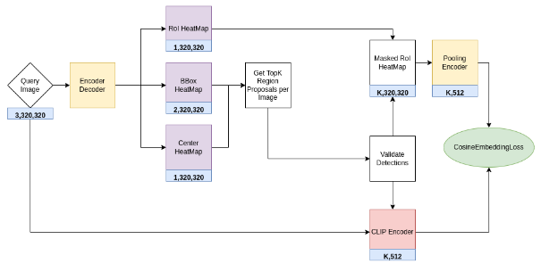

# CLIPtheCenter
Project is in Progress

## Introduction

This project is part of my master thesis at Technical University of Munich (TUM). I am advised by  Dr. rer. nat. Felix Dietrich from TUM along with M. Sc. Mathias Sundholm, M. Sc. Alexander Dolokov from Precibake GmBH.

## Model Architecture

 

## Training and Evaluation Scripts.

These are currently under development. Final code as well as results will be available shortly

Copyright © 2022 Rahul Parthasarathy Srikanth, PSRahul
